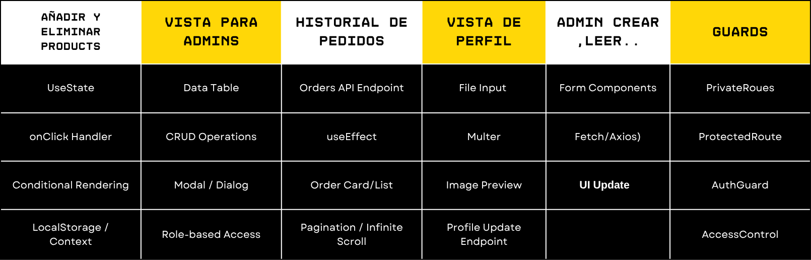

# 🦆 Patukis E-commerce Frontend

Frontend de una aplicación de e-commerce construida con **React**, diseñada para la venta de productos _Patukis_ (patos de goma personalizados).

---

## 🎯 Objetivos del Proyecto

Desarrollar un frontend **robusto** y **responsivo** con funcionalidades esenciales para una tienda online:

- Registro e inicio de sesión de usuarios.
- Visualización de productos.
- Gestión del carrito de compra.
- Creación y seguimiento de pedidos.
- Perfil de usuario y lista de deseos.
- Administración de productos (solo para admins).

---

## 🚀 Características Implementadas



### 🧑‍💻 Autenticación de Usuarios

- **Registro**  
  Mediante el componente `RegisterForm`.

- **Inicio de Sesión**  
  Gestionado por `LoginForm`, con autenticación vía API y redirección tras inicio exitoso.

- **Cierre de Sesión**  
  Implementado mediante el componente `LogoutButton`.

---

### 🛍️ Visualización de Productos

- **Listado General**  
  Todos los productos disponibles se muestran con el componente `GetProducts`.

- **Detalle de Producto**  
  Página individual `GetOneProduct`, para vista detalle de los productos, con descripción y función de like.

---

### 🛒 Gestión del Carrito

- Añadir productos desde la lista o detalle de productos.
- Eliminar productos directamente desde el carrito.
- Badge numérico en el ícono del carrito (en `Navbar`) con la cantidad total de ítems.

---

### 👤 Gestión de Perfil

- Vista `Profile` que muestra:
  - Información del usuario autenticado.
  - Lista de deseos (`wishlist`).
  - Historial de pedidos realizados.

---

### 🛠️ Administración de Productos (solo "mamapato")

- Componente `AdminProducts` para usuarios con rol `mamapato`.
- Tabla con opciones para editar o eliminar productos.
- Interacciones mediante `confirm()` y `alert()` del navegador.

---

### 📱 Diseño Responsivo

- Adaptación de la interfaz para pantallas móviles y escritorio.
- Navegación dinámica (`Navbar` y `Footer`) basada en el tamaño de pantalla y rol del usuario (`Responsive`).

---

### 💠 Componentes Extra

- `BlobSVG`: Componente SVG decorativo con formas dinámicas.

---

## ⚙️ Instalación y Ejecución Local

1. **Clonar el repositorio**

   ```bash
   git clone https://github.com/alejandrogoscu/Patukis
   cd Patukis
   ```

2. **Instalar dependencias**

   ```bash
   npm install
   ```

   Dependencias esenciales:

   ```bash
   npm install react react-dom react-router-dom axios antd sass
   npm create vite@latest
   npm install react-router-dom@6
   ```

3. **Iniciar la aplicación**

   ```bash
   npm run dev
   ```

   Esto iniciará el servidor de desarrollo y abrirá la app en:

   ```
   http://localhost:5173
   ```

4. **Otros comandos útiles**
   ```bash
   rafce
   npm install react-icons --save
   npm install antd
   npm install sass --save-dev
   ```

---

## 🛠️ Tecnologías Utilizadas

- **React.js** – Librería principal de la interfaz.
- **React Router DOM** – Navegación y enrutamiento dinámico.
- **Axios** – Cliente HTTP basado en promesas.
- **Ant Design (antd)** – Componentes de interfaz estilizados.
- **Sass (SCSS)** – Preprocesador CSS modular.
- **Context API** – Gestión de estado global.
- **Git** – Control de versiones (ramas `main` y `develop`).

---

## ✨ Mejoras Futuras

- 🔍 **Buscador de productos** por nombre.
- 🧩 **Filtros de productos** por precio u otras propiedades.
- 📝 **Sistema de Reseñas** y permitir la subida de fotos
- 📦 **Subir fotos de perfil** accesible para el usuario.

---

## 📬 Contacto

Proyecto desarrollado por el equipo de **LaDuckWeb**.  
Para sugerencias o incidencias, por favor abra un _issue_ en el repositorio o contacte directamente.

---

## 📄 Licencia

Este proyecto está licenciado bajo los términos de [MIT License](LICENSE).
